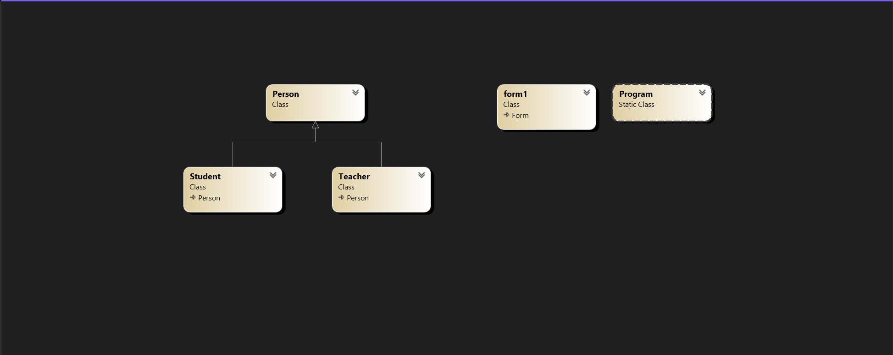

# quiz-oop
นายธีร ริ้วทวี รหัสนักศึกษา: 653450288-5
A.

B. 
Encapsulation		ใช้ private set; และเมธอด AddStudent(), GetStudents() 
Abstraction		แยกคลาส Person, Student, Teacher ออกจากกัน 
Inheritance		Student และ Teacher สืบทอดจาก Person 
Polymorphism		ใช้ virtual และ override ใน GetInfo()
